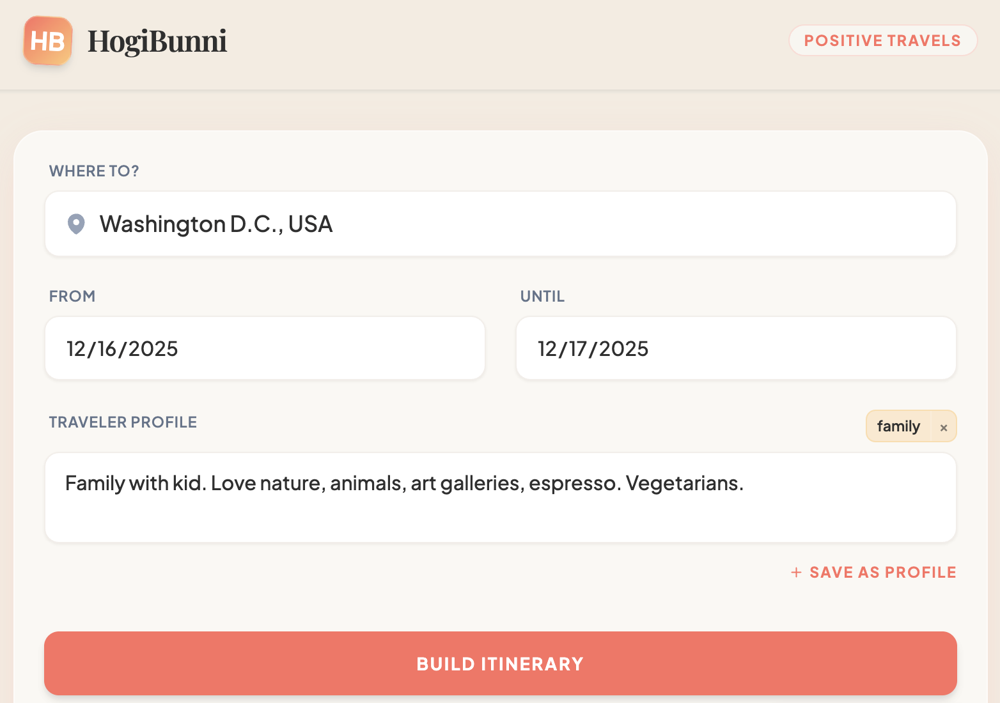

# HogiBunni

**HogiBunni** is an optimistic, AI-powered travel itinerary builder that creates personalized, day-by-day travel plans. It combines the reasoning power of Large Language Models with the accuracy of Google Maps to ensure every suggestion is a real, verified place.

The name is derived from the Kannada phrase **"Hogi Banni"** (ಹೋಗಿ ಬನ್ನಿ), which literally translates to "Go and return" — a heartwarming way to say goodbye to a traveler, ensuring they return safely.
## Demo

**[36-second silent demo](https://www.loom.com/share/2952c30088ee4fc2885be3a799167dd0)** showing the V1 flow: input -> orchestration -> structured output.

This repository documents a V1 prototype.  
If you’re interested in trying the live version or sharing feedback, feel free to reach out.

## ✨ Key Features

*   **Verified Intelligence**: Uses a hybrid approach of Generative AI for planning and **Google Maps Grounding** for verification. Zero hallucinations—every place suggested exists in the real world.
*   **Context Aware**: Checks **Live Weather** and **Public Holidays** for your specific dates. (e.g., Suggests indoor museums during rain).
*   **Interactive Refinement**: Don't like a suggestion? Mark it as "Remove" and the AI will surgically replace just that slot while keeping the rest of your plan intact.
*   **Eco-Friendly Clustering**: Automatically groups daily activities by neighborhood to minimize transit time and carbon footprint.
*   **Local Persistence**: Saves traveler profiles and recent searches directly to your browser.
*   **Shareable Plans**: Generate professional PDFs or copy formatted text summaries to share with friends.

## Architecture Overview (V1)

This project is a deliberately scoped V1 prototype that explores how an LLM can be integrated into a user-facing workflow for travel planning, with an emphasis on clarity, reliability, and architectural restraint.

The system follows a simple three-layer design:

### 1. Frontend (Web UI)
The frontend collects user input (destination, dates, and a free-form description of the travel party), displays progress, and renders structured itinerary output. It also provides lightweight share and print views, implemented without user accounts or persistent user state.

### 2. Backend / Orchestration Layer
The backend acts as a thin orchestration layer responsible for:

- validating and normalizing user input
- constructing prompts
- invoking the LLM
- post-processing the response into a predictable, structured format

This layer intentionally contains the application logic, keeping the frontend simple and the LLM isolated behind a clear interface.

### 3. LLM Integration

The LLM is used as a reasoning and generation component, not as an application controller. Prompt design and output constraints are used to reduce hallucinations and ensure consistently structured results suitable for direct user consumption.

## Design Trade-offs (Intentional for V1)

Stateless by design: no user accounts, long-term storage, or personalization

Optimized for clarity and iteration speed rather than scale

Share/print implemented as shallow features to support usability without introducing identity or data-retention complexity

If evolved beyond V1, the system could be extended with persistence, personalization, and scaling strategies, but those concerns are intentionally deferred to keep the prototype focused and inspectable.
