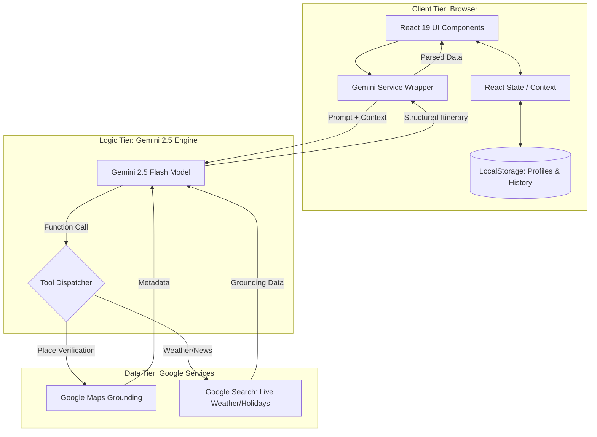

# HogiBunni

**HogiBunni** is an AI-powered travel itinerary builder that generates realistic, day-by-day plans using LLM reasoning grounded in Google Maps data - ensuring every suggested place exists, is locatable, and contextually appropriate.

The name is derived from the Kannada phrase **"Hogi Banni"** (ಹೋಗಿ ಬನ್ನಿ), which literally translates to "Go and return" - a heartwarming way to say goodbye to a traveler, ensuring they return safely.

&nbsp;

## Demo

**[36-second silent demo](https://www.loom.com/share/2952c30088ee4fc2885be3a799167dd0)** showing the V1 flow: input -> orchestration -> structured output.

This repository documents a V1 prototype.  
**If you’re interested in trying the live version, discussing the architecture, or sharing feedback, feel free to reach out.**

&nbsp;

The following diagram illustrates the high-level architecture of HogiBunni as a client-side heavy Single Page Application (SPA).

## Key Features

*   **Verified Intelligence**: Uses a hybrid approach of Generative AI for planning and **Google Maps Grounding** for verification. Every suggested venue is verified against Google Maps before being shown to the user.
*   **Context Aware**: Checks **Live Weather** and **Public Holidays** for your specific dates. (e.g., Suggests indoor museums during rain).
*   **Interactive Refinement**: Don't like a suggestion? Mark it as "Remove" and the AI will surgically replace just that slot while keeping the rest of your plan intact.
*   **Eco-Friendly Clustering**: Automatically groups daily activities by neighborhood to minimize transit time and carbon footprint.
*   **Local Persistence**: Saves traveler profiles and recent searches directly to your browser.
*   **Shareable Plans**: Generate professional PDFs or copy formatted text summaries to share with friends.

&nbsp;

This project is a deliberately scoped V1 prototype that explores how an LLM can be integrated into a user-facing workflow for travel planning, with an emphasis on clarity, reliability, and architectural restraint.

*   **Frontend**: React 19 + TypeScript + Vite.
*   **Styling**: Tailwind CSS with a custom "Warm & Optimistic" design system.
  
*   **AI Engine**: Google Gemini API ('gemini-2.5-flash') via the '@google/genai' SDK. 
    *   Chosen for tight integration with Google Search and Google Maps tooling.
    *   Prioritizes fast iteration and reliable tool grounding over raw model benchmarking.
    *   Model choice is intentionally flexible and can be swapped as requirements around cost, latency, or reasoning depth evolve.
      
*   **Data Sources**:
    *   **Google Maps Tool**: Used for verifying place existence, getting addresses, and ratings.
    *   **Google Search Tool**: Used for live weather forecasting and finding public images/pricing.

&nbsp;

## Design Considerations & Trade-offs

HogiBunni was designed with a focus on **Resilience, Cost-Efficiency, and User Trust**. Below are the key architectural decisions:

### 1. Verification-First Grounding (Trust vs. Latency)
*   **The Problem**: LLMs are prone to "hallucinating" - for example, "finding" charming but non-existent cafes.
*   **The Solution**: Implemented a strict **Grounding Filter**. Every suggested venue must be successfully resolved by the `googleMaps` tool before it is presented to the user.
*   **Trade-off**: This adds ~1.5s to the initial response time but eliminates non-existent locations.

### 2. Model Selection: Gemini 2.5 Flash (Performance vs. Cost)
*   **Choice**: `gemini-2.5-flash-latest`.
*   **Rational**: For a high-frequency travel app, throughput and latency are critical. Flash offers a significant cost reduction (up to 10x) over Pro models while maintaining sufficient reasoning for 2-5 day itineraries.
*   **Optimization**: Utilized structured prompt engineering (`PARSE_PROMPT_INSTRUCTIONS`) to ensure consistent parsing without the overhead of more expensive model reasoning.

### 3. Resilience: Exponential Backoff Strategy
*   **The Challenge**: Free-tier API keys often encounter `429: Resource Exhausted` errors during complex itinerary generation.
*   **Implementation**: The `geminiService.ts` implements a custom wrapper with exponential backoff.
    *   *Initial Delay*: 2000ms.
    *   *Multiplier*: 2x per failure.
*   **Result**: High availability even under quota pressure, preventing application crashes during peak usage.

### 4. Privacy-Centric Persistence (Serverless Architecture)
*   **Decision**: 100% Client-side storage via `localStorage`.
*   **Trade-off**: Cross-device syncing is sacrificed in the current version.
*   **Benefit**: Zero database costs, zero authentication friction for new users, and GDPR-by-design compliance (user data never leaves their device).

---

## External APIs & Cost Considerations

HogiBunni is designed as a V1 prototype with careful control over recurring API costs.

*   **Weather & Holiday Data**  
    Currently sourced via Google Search grounding to avoid introducing additional paid APIs during early validation.  
    The architecture supports replacing this with a dedicated Weather API (e.g., OpenWeather, Tomorrow.io) once usage patterns justify the cost.

*   **Design Principle**  
    Paid APIs are introduced only when they materially improve user experience beyond what can be achieved through existing grounded search tools.

&nbsp;

## Future Roadmap

*   **Flexible Planning**: Drag-and-drop functionality to move activities from one day to another.
*   **Social Collaboration**: Invite friends to a "Trip" to collectively vote on, approve, or delete activities in real-time until the itinerary is finalized.
*   **Daily Route Maps**: Interactive map visualization for each day with highlighted routes to visualize commute and clustering.
*   **Budget Calculator**: Real-time summation of estimated ticket costs.
*   **User Accounts**: Transition from local storage to cloud accounts (Supabase/Firebase) for long-term storage of trips and traveler profiles.
*   **Post-Travel Reviews**: Ability for users to rate places after they visit to improve future AI recommendations.
*   **Curated Lists**: Users can create and publish their own "Recommended Lists" of places for the community.

This project intentionally focuses on reliability, grounding, and iterative UX over feature breadth.
Future work will prioritize collaboration and long-term trip management once core planning trust is established.

&nbsp;

